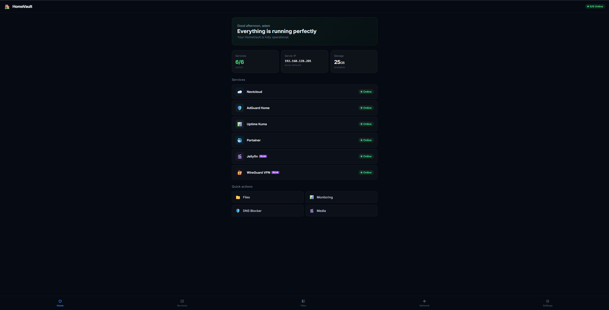

# 🏠 HomeVault

**Turn any mini-PC into a powerful personal home server.**

HomeVault transforms affordable mini-PCs into fully-featured home servers with cloud storage, ad blocking, media streaming, VPN access, and monitoring — all with a single install script.



---

## 🚀 What is HomeVault?

HomeVault is a pre-configured home server solution that runs on Proxmox VE. It uses Docker containers inside an LXC container for maximum efficiency on low-power hardware.

### HomeVault Basic
- ☁️ **Nextcloud** — Your personal cloud (files, contacts, calendar)
- 🛡️ **AdGuard Home** — Network-wide ad & tracker blocking
- 📊 **Uptime Kuma** — Service monitoring & alerts
- 🐳 **Portainer** — Docker management UI
- 🏠 **HomeVault Dashboard** — Beautiful customer-facing web UI

### HomeVault Plus *(everything in Basic, plus:)*
- 🎬 **Jellyfin** — Stream movies, series & music
- 🔐 **WireGuard VPN** — Secure remote access

---

## 📋 Requirements

| Component | Minimum | Recommended |
|-----------|---------|-------------|
| CPU | Intel N5095 or similar | Intel N100+ |
| RAM | 8 GB | 16 GB |
| Storage | 128 GB SSD | 256 GB+ SSD |
| Network | Ethernet port | Gigabit Ethernet |
| USB | 16 GB USB stick (for installation) | - |

### Tested Hardware
- MLLSE M2 (Intel N5095, 8GB RAM, 128GB SSD)
- Teclast N20 (Intel N5095, 8GB RAM, 128GB SSD)

---

## 🛠️ Installation

### Step 1: Install Proxmox VE

1. Download [Proxmox VE ISO](https://www.proxmox.com/en/downloads/proxmox-virtual-environment/iso) (latest version)
2. Flash it to a USB stick using [Rufus](https://rufus.ie/):
   - Select the ISO
   - Partition scheme: **GPT** (or MBR if GPT is greyed out)
   - If asked, choose **DD Image mode**
3. Boot the mini-PC from USB (press **F7**, **Del**, **F2**, or **F11** at startup)
4. Follow the Proxmox installer — use a simple password (numbers only to avoid AZERTY/QWERTY issues)
5. After installation, remove USB and reboot
6. Access Proxmox at `https://<IP>:8006` from another computer

### Step 2: Fix Proxmox Repositories

Open the Proxmox **Shell** (click your node → Shell) and run:

```bash
# Disable enterprise repos (handle both .list and .sources formats)
for f in /etc/apt/sources.list.d/pve-enterprise.list /etc/apt/sources.list.d/ceph.list; do
    [ -f "$f" ] && sed -i 's/^deb/#deb/' "$f"
done
for f in /etc/apt/sources.list.d/pve-enterprise.sources /etc/apt/sources.list.d/ceph.sources; do
    [ -f "$f" ] && rm "$f"
done

# Add free repository
CODENAME=$(grep VERSION_CODENAME /etc/os-release | cut -d= -f2)
echo "deb http://download.proxmox.com/debian/pve ${CODENAME} pve-no-subscription" > /etc/apt/sources.list.d/pve-no-subscription.list

# Update
apt-get update -y
```

### Step 3: Run the HomeVault Installer

Still in the Proxmox Shell:

```bash
# Download and run the installer
curl -sL https://raw.githubusercontent.com/Adambck/homevault/main/scripts/install.sh -o /root/install.sh
chmod +x /root/install.sh
bash /root/install.sh
```

The installer will:
1. Download the LXC template
2. Create a container (ID: 100)
3. Install Docker
4. Deploy all services
5. Set up the HomeVault Dashboard

Choose **1** for Basic or **2** for Plus when prompted.

### Step 4: Access Your HomeVault

After installation completes, open these URLs in your browser:

| Service | URL | Default Login |
|---------|-----|---------------|
| 🏠 **Dashboard** | `http://<IP>:80` | Setup wizard |
| ☁️ **Nextcloud** | `http://<IP>:8080` | Create on first visit |
| 🛡️ **AdGuard Home** | `http://<IP>:8053` | Setup wizard |
| 📊 **Uptime Kuma** | `http://<IP>:3001` | Create on first visit |
| 🐳 **Portainer** | `http://<IP>:9000` | Create on first visit |
| 🎬 **Jellyfin** *(Plus)* | `http://<IP>:8096` | Setup wizard |
| 🔐 **WireGuard** *(Plus)* | UDP :51820 | Config files |
| 🖥️ **Proxmox** | `https://<PROXMOX-IP>:8006` | root / your password |

> Replace `<IP>` with the container IP (usually `x.x.x.201`) and `<PROXMOX-IP>` with the Proxmox host IP (usually `x.x.x.200`).

---

## 🏗️ Architecture

```
Mini-PC Hardware
└── Proxmox VE (Host OS)
    └── LXC Container (ID: 100) — "homevault"
        └── Docker
            ├── homevault-dashboard  (port 80)
            ├── nextcloud            (port 8080)
            ├── nextcloud-db         (MariaDB)
            ├── adguard              (port 8053, DNS: 53)
            ├── uptime-kuma          (port 3001)
            ├── portainer            (port 9000)
            ├── jellyfin             (port 8096)  [Plus]
            └── wireguard            (port 51820) [Plus]
```

---

## 📱 Dashboard Features

The HomeVault Dashboard is what your customers see when they open `http://<IP>` in their browser.

- **Setup Wizard** — Name and language selection on first visit
- **4 Languages** — Dutch, French, English, Arabic (with RTL support)
- **Live Monitoring** — Real-time service status checks every 25 seconds
- **5 Tabs:**
  - 🏠 Home — Status overview, quick stats, service list, quick actions
  - ◫ Services — Grouped by category with live status
  - 📁 Files — Embedded Nextcloud file browser
  - ◈ Network — IP info, ports, DNS setup guide
  - ⚙ Settings — Language, system links, about, reset

---

## 🔧 For Sellers: Quick Setup Guide

If you're selling pre-configured HomeVault mini-PCs:

### One-Time Setup (per mini-PC)

1. Install Proxmox VE via USB
2. Fix repos (Step 2 above)
3. Run the install script (Step 3 above)
4. Verify all services work
5. **Reset the dashboard** (Settings → Reset) so the customer gets the setup wizard
6. Package and ship

### What the Customer Does

1. Plug in the mini-PC (power + ethernet to router)
2. Open `http://<IP>` in their browser
3. Complete the setup wizard (name + language)
4. Done — everything works

---

## 📁 Repository Structure

```
homevault/
├── README.md              # This file
├── scripts/
│   ├── install.sh         # Main installer (Basic + Plus)
│   └── dashboard.html.gz.b64  # Dashboard (base64 encoded)
├── dashboard/
│   └── index.html         # Dashboard source code
└── docs/
    └── images/            # Screenshots
```

---

## ⚡ Useful Commands

```bash
# SSH into Proxmox host
ssh root@<PROXMOX-IP>

# Enter the HomeVault container
pct exec 100 -- bash

# Check running services
pct exec 100 -- docker ps

# Restart all services
pct exec 100 -- bash -c 'cd /opt/homevault && docker compose restart'

# View logs
pct exec 100 -- docker logs <container-name>

# Update all images
pct exec 100 -- bash -c 'cd /opt/homevault && docker compose pull && docker compose up -d'

# Stop everything
pct exec 100 -- bash -c 'cd /opt/homevault && docker compose stop'

# Start everything
pct exec 100 -- bash -c 'cd /opt/homevault && docker compose up -d'
```

---

## 🤝 Contributing

This project is maintained by [Adam Bouchikhi](https://linkedin.com/in/adambouchikhi).

---

## 📄 License

MIT License — see [LICENSE](LICENSE) for details.
